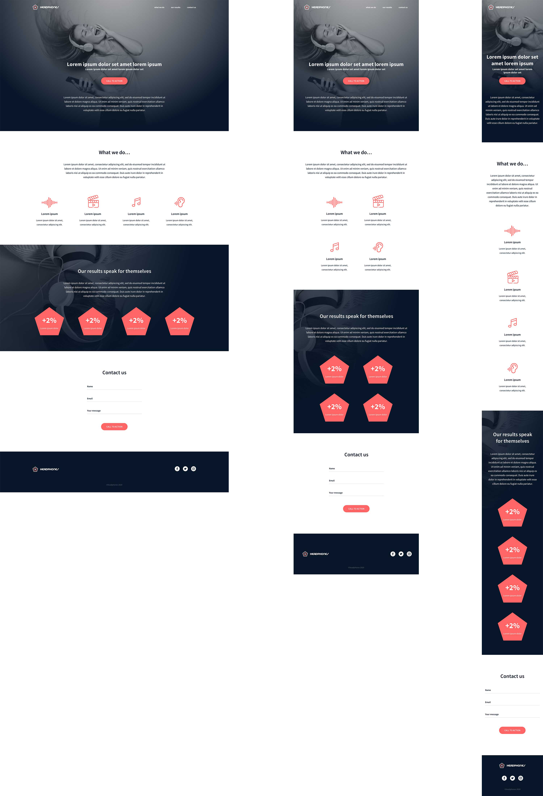

# Web Stack Programming 2024 - Headphones Project

Welcome to the **Headphones** project repository! This project involves creating a fully functional web page from scratch based on a provided design. Below you'll find detailed instructions and guidelines for each task to ensure you meet all the requirements and deliver a polished final product.

## Project Overview

In this project, you will implement a web page using HTML and CSS only. External CSS frameworks and JavaScript are not allowed. Your goal is to replicate the design provided by the UI/UX designer **Nicolas Philippot**.




## Requirements

- **No External CSS Frameworks**: Use only custom CSS.
- **No JavaScript**: Achieve functionality using only HTML and CSS.
- **Responsive Design**: Ensure the page adapts to a screen width of 480px or less.
- **Accessibility**: Ensure the webpage is accessible and meets basic standards.
- **Design Fidelity**: Match the design provided by the designer.

## Figma Access

1. **Figma Setup**: Create an account on [Figma](https://figma.com) if you don’t already have one.
2. **Project Access**: Open the provided Figma project and duplicate it to your drafts for design details.
3. **Fonts**: Ensure you have the required fonts:
   - [Source Sans Pro](https://fonts.google.com/specimen/Source+Sans+Pro)
   - [Spin Cycle OT](https://www.fontsquirrel.com/fonts/spin-cycle)

## Key Guidelines

- **CSS Reset**: Start with a CSS reset for consistent styling across browsers.
- **CSS Variables**: Use CSS variables for managing color schemes and font sizes.
- **Selectors**: Use simple and generic CSS selectors. Avoid overly specific ones.
- **HTML Structure**: Maintain a simple and logical HTML structure. Use div containers where necessary.
- **Responsiveness**: Ensure the webpage adapts to different screen sizes, especially for mobile views.

## Getting Started

1. **Clone the Repository**:
   ```bash
   git clone https://github.com/NACIMSAAFI/holbertonschool-headphones.git